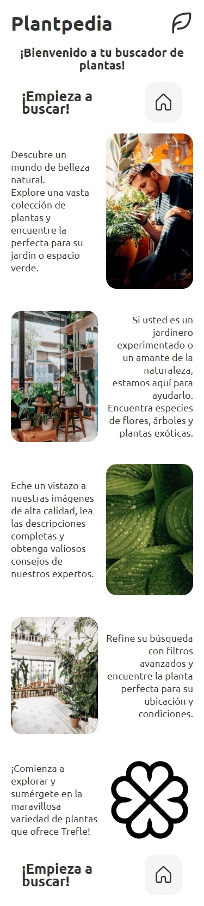
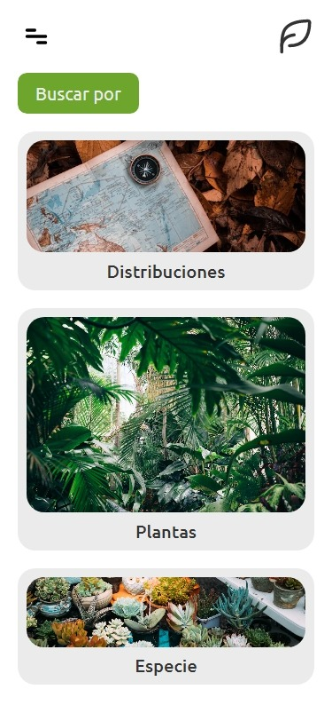
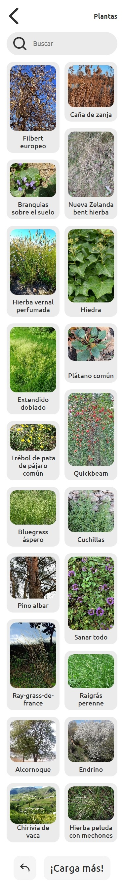
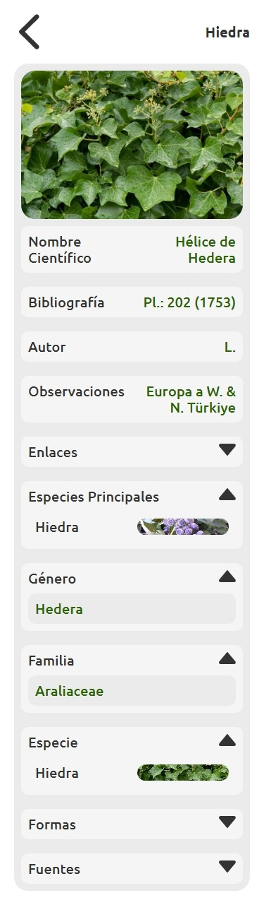

# Plantpedia

Welcome to Plantpedia!
🍀! This app allows you to find and explore a wide variety of plants and species associated with them. Whether you are a gardening enthusiast, an amateur botanist, or just someone curious about the world of plants, this tool will provide you with valuable and detailed information.

## Features

- Responsive design.

- Mobile preferential design.

- **Plant Search**: You can search for plants by common or scientific name and explore a vast database of plant species.

- **Details and Descriptions**: Each plant has a detailed page that provides essential information such as common and scientific names, descriptions, species, families and much more.

- **Image Gallery**: Explore a beautiful gallery of images of plants and associated species.

## Demo

- [Netlify](https://plantpedia-im-victor-mendez.netlify.app/)

## Build with

- [React.js](https://react.dev/)
- [Figma](https://www.figma.com/)
- [Firebase](https://firebase.google.com/)
- [Unsplash](https://unsplash.com/)
- [Sass](https://sass-lang.com/)

## Screenshots

<div style="display: flex;">
  <div style="flex: 1;">
    
  </div>
  <div style="flex: 1;">
    
  </div>
  <div style="flex: 1;">
    
  </div>
  <div style="flex: 1;">
    
  </div>
</div>

## Run locally

1. Clone this repository to your local machine using the following command:
    ```
    git clone https://github.com/im-victor-mendez/plantpedia.git
    ```

2. Navigate to the project's backend directory and install the necessary dependencies:
    ```
    cd plantpedia/backend
    npm install
    ```

3. Navigate to the project's frontend directory and install the necessary dependencies:
    ```
    cd plantpedia/frontend
    npm install
    ```

4. Start the backend application in its directory:
    ```
    cd plantpedia/backend
    npm start
    ```

5. Generate the frontend build and see its preview in your directory:
    ```
    cd plantpedia/frontend
    npm run build
    npm run preview
    ```
     Or in your case start the frontend in development mode:
     ```
    cd plantpedia/frontend
    npm run dev
    ```

6. Open your web browser and visit `http://localhost:5173` to access Plantpedia.

## Continuous Integrations

- [ ] Filter by categories, such as trees, shrubs, flowers, succulents, etc.

- [ ] Physical characteristics, growing conditions, natural habitats and much more.

- [ ] Get a visual overview of each plant and discover its appearance at different stages of growth.

- [ ] **Bookmarks and Favorites**: You can bookmark your favorite plants and create a personalized list of plants that interest you. In this way, you can quickly access information on your favorite species at any time.

- [ ] **Share and Collaborate**: Share your discoveries and knowledge about plants with other users. You can share links to specific species on social networks or send recommendations by email.

# Author

Plantpedia was created by Victor Mendez:
- [GitHub](https://github.com/im-victor-mendez).
- [Linkedin](https://www.linkedin.com/in/im-victor-mendez)